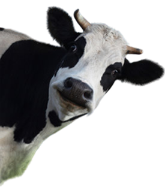

# 🐄 SapiGo — Biometric Handover Verification for Cattle

**SapiGo** is a mobile-first web MVP that helps cattle resellers verify a cow’s identity before it leaves inventory. It uses the animal’s muzzle pattern as a biometric reference, adding an auditable verification step between a selected digital record and the physical cow at handover.

<p align="center">
  
</p>


## 🎯 The problem SapiGo solves

At the point of cow-out, a correct inventory record does not by itself prove that the physical cow being released is the selected animal. SapiGo introduces a practical decision point: capture a current muzzle image, compare it with that cow’s enrolled biometric template, and only record cow-out when the result is **verified**.

SapiGo complements existing identifiers and processes—such as ear tags, RFID, invoices, official records, and human inspection. It does **not** establish legal ownership, replace official traceability systems, diagnose animal health, or guarantee an error-free transfer.

## ✨ Key features

### 🤖 Biometric verification

- **Guided muzzle enrolment** — capture centre, left, and right reference photos for a cow.
- **Embedding-based matching** — a PyTorch model produces normalized 256-dimensional muzzle embeddings, compared using cosine similarity.
- **Image-quality gate** — reject blurry, poorly exposed, or clipped images before enrolment or inference.
- **Verification evidence** — retain the live image asset, similarity score, decision, model version, and timestamp.

### 🚚 Inventory and transfer control

- **Cow inventory** — create, view, and manage owner-scoped cattle records.
- **Verification-gated cow-out** — a transfer writes `transferred_at` only after a `verified` biometric result.
- **Safe failed outcome** — a mismatch leaves the cow active in inventory; an unusable photo prompts a retake.
- **Reseller workflows** — register cattle, review inventory, perform verification, and prepare a transfer through a mobile-oriented interface.

### 🔐 Account experience

- Phone OTP sign-in, authenticated sessions, CSRF protection, and profile onboarding.
- Indonesian-language interface for the reseller application.

## 🏗️ Architecture overview

```text
Reseller (mobile browser)
          │
          ▼
Next.js frontend ──► FastAPI API ──► PostgreSQL + pgvector
                          │                   │
                          ▼                   ▼
                 PyTorch muzzle model    Cloudinary image assets
                          │
                          ▼
         verified → record transferred_at
         mismatch → keep cow in inventory
```

## 🔄 Core workflow

1. **Register a cow** — the reseller creates an inventory record.
2. **Enrol its muzzle** — upload guided reference photos; accepted images become one normalized biometric template.
3. **Select the cow to release** — choose an active cow and supply the recipient phone number for the transfer flow.
4. **Capture a live muzzle photo** — SapiGo quality-checks the image and compares it to the enrolled template.
5. **Record or block cow-out** — `verified` records `transferred_at`; a mismatch leaves inventory unchanged.

> The recipient phone number is currently validated at the API boundary but is not stored as a recipient or transaction record. The implemented automated decisions are `verified` and `mismatch`; `manual_review` is a planned operational capability.

## 🛠️ Technology stack

| Layer | Technology |
| --- | --- |
| Frontend | Next.js 16, React 19, TypeScript, Tailwind CSS |
| Backend | FastAPI, Pydantic, SQLAlchemy, Uvicorn |
| Biometric AI | PyTorch, ResNet50-based embedding network, cosine similarity |
| Data | PostgreSQL, pgvector, Alembic |
| Media | Cloudinary |
| Authentication | Phone OTP with JWT, HTTP-only cookies, and CSRF validation |
| Delivery | Docker and Docker Compose |

## 📁 Project structure

```text
Sapigo/
├── backend/
│   ├── app/
│   │   ├── ai_service/       # Muzzle embedding, enrolment, and verification
│   │   ├── core/             # Configuration, authentication, database setup
│   │   ├── model/            # SQLAlchemy models and enums
│   │   ├── repository/       # Persistence layer
│   │   ├── route/            # FastAPI endpoints
│   │   ├── schema/           # Pydantic request/response schemas
│   │   └── service/          # Application business logic
│   ├── migration/            # Alembic migrations
│   └── dockerfile            # Backend container definition
├── frontend/
│   ├── src/app/              # Next.js App Router pages and flows
│   ├── src/components/       # Reusable UI and domain components
│   ├── src/features/         # Registration and transfer form logic
│   └── src/lib/              # API client, auth, hooks, and utilities
└── docs/                     # MVP proposal and project documentation
```

## 🚀 How to run

The backend needs its `.env` configuration for the database, Cloudinary, and authentication services. For local frontend development, set `NEXT_PUBLIC_API_URL` in `frontend/.env.local` to `http://127.0.0.1:8000`.

### Backend with Docker

Run these commands from `backend/`.

Build the image. This also pulls the trained embedding model weights from Hugging Face automatically, no manual download needed:

```bash
docker build -t sapigo-backend .
```

Model weights are pulled from [SapiGo/Muzzle-Biometric-Embedding](https://huggingface.co/SapiGo/Muzzle-Biometric-Embedding/tree/main) on Hugging Face during the build.

Run the container:

```bash
docker run --rm -p 8000:8000 sapigo-backend
```

The API will be available at `http://localhost:8000`.
Docs (OpenAPI) at `http://localhost:8000/docs`.

### Local development

Run these commands from their respective directories:

```bash
# backend/
uv sync
uv run alembic upgrade head
uv run dev

# frontend/
npm install
npm run dev
```

Open the frontend at [http://localhost:3000](http://localhost:3000) and the API documentation at [http://localhost:8000/docs](http://localhost:8000/docs).

## 🔌 Main API journey

All application endpoints are prefixed with `/api`.

```text
POST /api/animals                              create a cow record
POST /api/media-assets/upload   (reference ×3) upload quality-checked muzzle photos
POST /api/animals/{animal_id}/enroll           create or replace its template
POST /api/animals/{animal_id}/verify           verify a live muzzle photo
POST /api/animals/{animal_id}/transfer         verify and, if matched, record cow-out
```

Interactive endpoint documentation is available at `/docs` while the backend is running.

## 📊 Evaluation principles

Muzzle biometrics are promising, but SapiGo does not make an accuracy claim without local evaluation. A field pilot should use identity-disjoint training, validation, and test sets, then report false-accept and false-reject rates, image-rejection rate, verification time, and audit-record completeness. Thresholds should be selected based on the operational cost of both wrong releases and false blocks.

## 🗺️ Roadmap

- [x] Cattle registration and inventory management
- [x] Multi-angle muzzle capture and biometric template enrolment
- [x] Quality-gated live verification with auditable evidence
- [x] Biometric-gated cow-out timestamp
- [x] Reseller-focused mobile web workflows and OTP authentication
- [ ] Server-side authorization derived from the authenticated user
- [ ] Manual-review workflow and resolution record
- [ ] Recipient, custody, and delivery records
- [ ] Field evaluation on representative local data
- [ ] Automated unit, API-integration, and end-to-end test suites

## 📄 References

- Li, G., Erickson, G. E., & Xiong, Y. (2022). *Individual beef cattle identification using muzzle images and deep learning techniques.* [Animals](https://doi.org/10.3390/ani12111453).
- Lee, T., Na, Y., Kim, B. G., Lee, S., & Choi, Y. (2023). *Identification of individual Hanwoo cattle by muzzle pattern images through deep learning.* [Animals](https://doi.org/10.3390/ani13182856).
  
---

**Built for safer, more accountable cattle handovers.**
